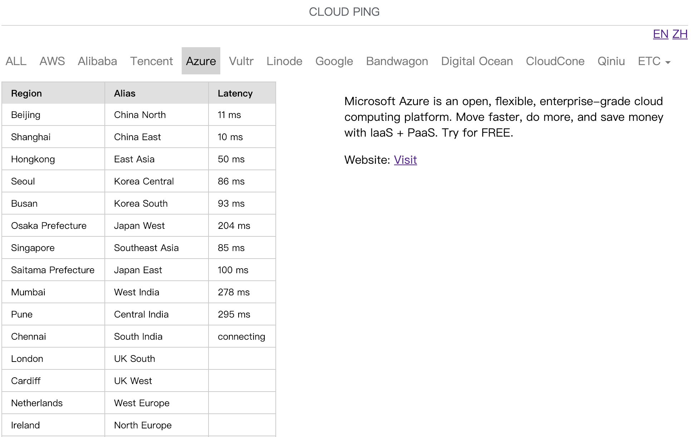

# [Cloud Ping](http://cloudping.bastionhost.org/en/) &nbsp; 

 &nbsp; 

This site allows you to perform an HTTP ping to measure the network latency from your browser to the various cloud data centers around the world.

Visit http://cloudping.bastionhost.org/ for all clouds!

This project has the following basic apps:

* ping - the core app which implement the main logic.

## Installation

To set up a development environment quickly, install Python 2.x first. It
comes with virtualenv built-in. so create a virtual environment with:

`virtualenv env`

`source env/bin/activate`

Install dependencies:

`pip install -r requirements.txt`

Run server:

`python manage.py runserver --settings=cloudping.settings.dev`

`sh configs/setup.sh` for production!

## Cloud endpoints

* AWS: http://ec2-reachability.amazonaws.com/
* Aliyun: https://help.aliyun.com/document_detail/40654.html
* Baidu Cloud: https://cloud.baidu.com/doc/BOS/S3.html#.E6.9C.8D.E5.8A.A1.E5.9F.9F.E5.90.8D
* Tencent Cloud: https://cloud.tencent.com/document/product/213/6091
* Huawei Cloud: https://developer.huaweicloud.com/endpoint?OBS
* Kingsoft Cloud: https://docs.ksyun.com/documents/6761
* Qiniu Cloud: https://developer.qiniu.com/kodo/manual/1671/region-endpoint
* Qing Cloud: https://docs.qingcloud.com/qingstor/api/common/overview.html#地址构成
* UCloud: https://docs.ucloud.cn/api/summary/regionlist
* MOS: https://www.mtyun.com/doc/products/manage/Region/index
* Microsoft Azure: https://azure.microsoft.com/zh-cn/regions/
* Google Cloud: https://cloud.google.com/compute/docs/regions-zones/
* Digital Ocean: http://speedtest-nyc1.digitalocean.com/
* Linode: https://www.linode.com/speedtest
* Vultr: https://www.vultr.com/faq/#downloadspeedtests

## Refs

* Project generated by [https://github.com/huifenqi/django-project-skeleton](https://github.com/huifenqi/django-project-skeleton)
* Some js code comes from [http://www.cloudping.info/](http://www.cloudping.info/)
